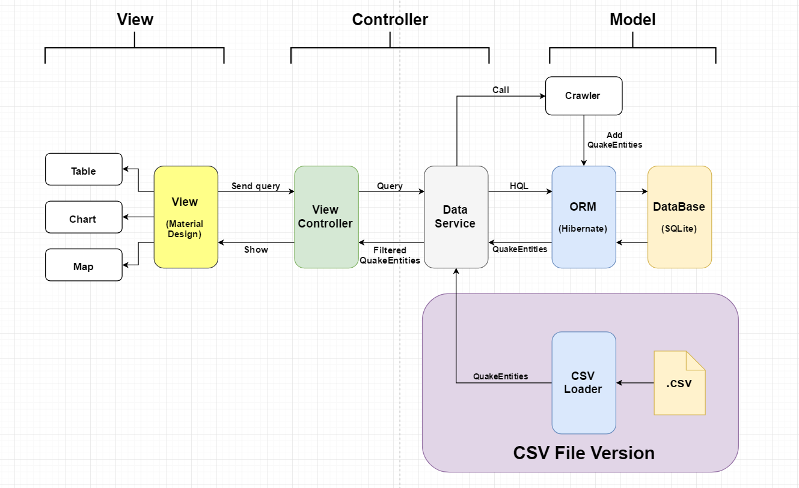

# Java2Project
## content
- The database manager and model of Java2Project with ORM framework `Hibernate`.
- earthquake data crawler
## structure

## Environment Configuration
### Hibernate
- #### Offical way
  Download JAR form [Hibernate.org](http://www.hibernate.org/downloads) and follow the guide.
- #### Using IDEA
  Create a new project and select the framework support of `Hibernate`. Then copy the files in `src` here to your `src`.
### Crawler
- Download the JAR from [jsoup.org](https://jsoup.org/download)
